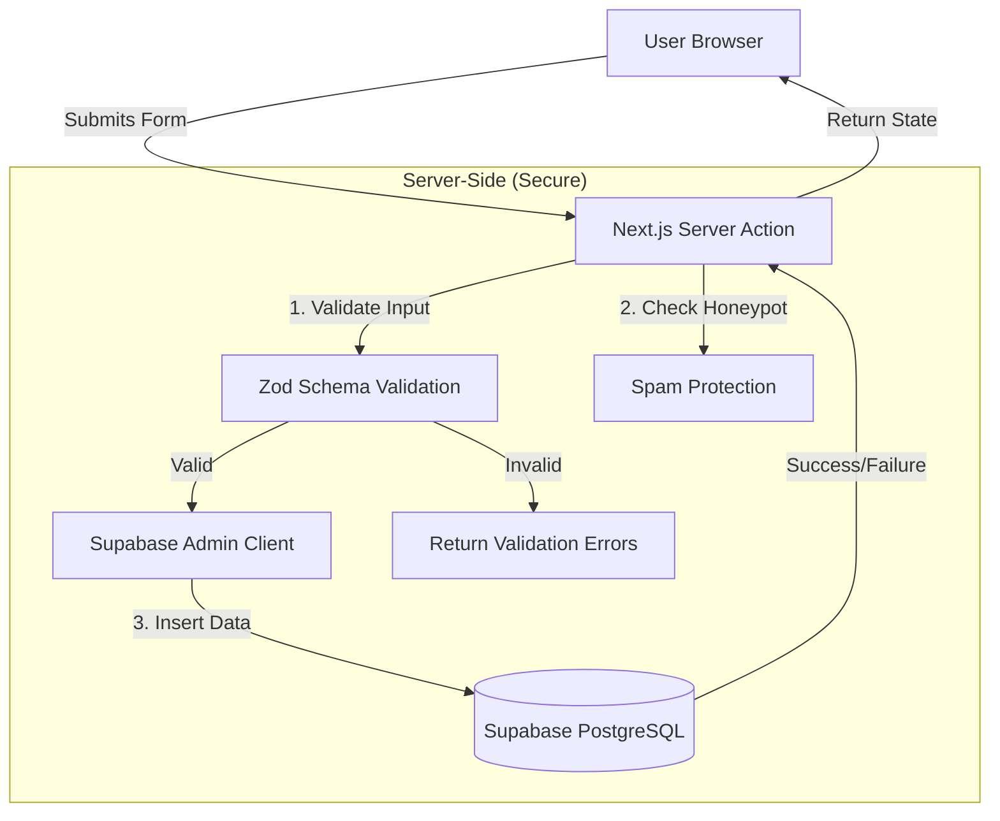
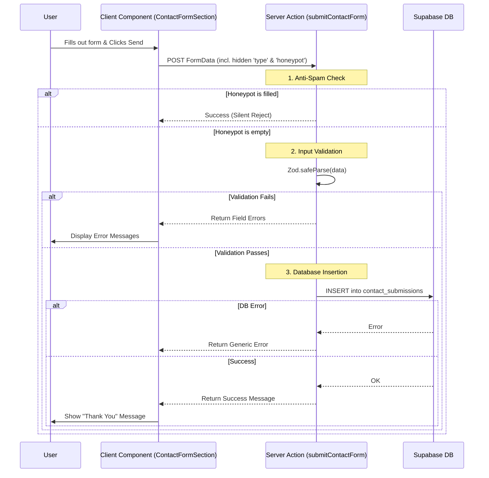

# Contact Form System Implementation Guide

This document details the architecture, design, and implementation steps for the Watto Contact Form system.

## 1. System Overview

The contact form system handles three distinct types of user inquiries:
1.  **Advertise with us**: For potential partners looking for media kits.
2.  **Get more info**: For general inquiries, press, or careers.
3.  **Buy our bottles**: For bulk or individual purchase inquiries.

The system is built using **Next.js Server Actions** for backend logic, **Zod** for validation, and **Supabase (PostgreSQL)** for persistence.

## 2. Architecture & Data Flow

### 2.1 High-Level Architecture



### 2.2 Detailed Submission Flow



## 3. Database Design

We use a single table strategy with an Enum to distinguish submission types. This simplifies querying and maintenance while allowing flexible metadata.

### Schema: `contact_submissions`

| Column | Type | Nullable | Description |
| :--- | :--- | :--- | :--- |
| `id` | UUID | No | Primary Key (auto-generated) |
| `created_at` | TIMESTAMPTZ | No | Submission timestamp (default: now()) |
| `submission_type` | ENUM | No | 'advertise', 'info', or 'buy' |
| `name` | TEXT | No | Submitter's name |
| `email` | TEXT | No | Submitter's email |
| `company` | TEXT | Yes | (Advertise only) |
| `budget` | TEXT | Yes | (Advertise only) |
| `goals` | TEXT | Yes | (Advertise only) |
| `topic` | TEXT | Yes | (Info only) |
| `message` | TEXT | Yes | (Info only) |
| `quantity` | TEXT | Yes | (Buy only) |
| `shipping_country` | TEXT | Yes | (Buy only) |
| `notes` | TEXT | Yes | (Buy only) |
| `metadata` | JSONB | Yes | Future-proofing for extra fields |

### Security (RLS)
- **Row Level Security** is ENABLED.
- **Service Role** (Admin) has full access.
- **Anon/Public** has NO direct access (inserts are handled via trusted Server Actions).

## 4. Implementation Details

### 4.1 Server Action (`app/actions/contact.ts`)
Handles the request cycle. It uses `React.useActionState` compatible return types (`success`, `message`, `errors`).

### 4.2 Zod Schemas (`lib/schemas/contact.ts`)
Defines strict rules for each form type.
- **Discriminated Union**: Uses the `type` field to apply different validation rules dynamically.

### 4.3 Supabase Admin Client (`lib/supabase/server.ts`)
Instantiates a Supabase client using the `SUPABASE_SERVICE_ROLE_KEY`. This key bypasses RLS policies, which is necessary since the public user is not authenticated.

## 5. Validation Logic

The application uses **Zod** to strictly validate all incoming data before it reaches the database. We utilize a **Discriminated Union** strategy based on the `type` field ('advertise', 'info', 'buy'). This ensures that fields required for one form type are not strictly enforced for another, while maintaining type safety.

### Common Fields (All Forms)
- **Name**: Required (min 2 characters).
- **Email**: Required (must be a valid email format).
- **Honeypot**: Optional string. **Must be empty**. If filled, it indicates a bot submission.

### Specific Validation Rules

#### 1. Advertise Form (`type='advertise'`)
| Field | Rule | Error Message |
| :--- | :--- | :--- |
| `company` | Required | "Company name is required" |
| `budget` | Required | "Budget selection is required" |
| `goals` | Min 10 chars | "Please describe your goals in more detail" |

#### 2. Info Form (`type='info'`)
| Field | Rule | Error Message |
| :--- | :--- | :--- |
| `topic` | Required | "Topic is required" |
| `message` | Min 10 chars | "Message is too short" |

#### 3. Buy Bottles Form (`type='buy'`)
| Field | Rule | Error Message |
| :--- | :--- | :--- |
| `quantity` | Required | "Quantity is required" |
| `shipping_country` | Min 2 chars | "Shipping country is required" |
| `notes` | Optional | N/A |

## 6. Error Handling Strategy

The system is designed to provide clear feedback to the user and helpful logs for the developer while maintaining security.

### Scenario 1: Validation Failure
- **Trigger**: User leaves a required field empty or provides invalid input (e.g., "goals" too short).
- **Action**: The server action returns `{ success: false, message: 'Validation failed...', errors: { fieldName: ['Error msg'] } }`.
- **UI Result**: The specific input field displays the error message in red text below the input. The generic "Validation failed" message is also shown.

### Scenario 2: Spam Detection (Honeypot)
- **Trigger**: A bot fills in the hidden `honeypot` field.
- **Action**: The server action logs a warning (`Honeypot filled...`) but returns a **fake success** response: `{ success: true, message: 'Message sent successfully!' }`.
- **Reasoning**: This prevents bots from knowing they failed and retrying with different parameters.

### Scenario 3: Database/Supabase Error
- **Trigger**: Supabase is down, network issues, or a schema mismatch.
- **Action**:
  1.  The error is caught in the `try/catch` block.
  2.  `console.error` logs the specific technical error on the server for debugging.
  3.  The client receives a generic failure message: `{ success: false, message: 'Failed to submit form. Please try again later.' }`.
- **UI Result**: An error alert box appears on the form.

### Scenario 4: Missing Environment Variables
- **Trigger**: `SUPABASE_URL` or `SUPABASE_SERVICE_ROLE_KEY` is not set in `.env.local`.
- **Action**: The `createAdminClient` function throws an error.
- **Result**: Handled by the generic `try/catch` block (Scenario 3). The server logs will explicitly state "Missing Supabase environment variables".

## 7. Setup & Deployment Steps

### Step 1: Environment Variables
Create or update `.env.local` in `watto-client/`:

```bash
SUPABASE_URL=your_project_url
SUPABASE_SERVICE_ROLE_KEY=your_service_role_key
```

> **⚠️ WARNING:** Never expose `SUPABASE_SERVICE_ROLE_KEY` in `NEXT_PUBLIC_` variables. It must remain server-side only.

### Step 2: Database Migration
Run the SQL migration script located at:
`watto-client/supabase/migrations/20260213_contact_schema.sql`

You can run this via the Supabase Dashboard (SQL Editor).

### Step 3: Deployment
1.  Push code to GitHub.
2.  Connect repository to Vercel.
3.  Add the Environment Variables in Vercel Project Settings.
4.  Deploy.

## 8. Directory Structure

```
watto-client/
├── app/
│   └── actions/
│       └── contact.ts       # Server Action logic
├── components/
│   └── contact/
│       └── ContactFormSection.tsx  # Client-side form UI
├── lib/
│   ├── schemas/
│   │   └── contact.ts       # Zod validation schemas
│   └── supabase/
│       └── server.ts        # Admin client initialization
└── supabase/
    └── migrations/
        └── 20260213_contact_schema.sql # SQL for DB setup
```