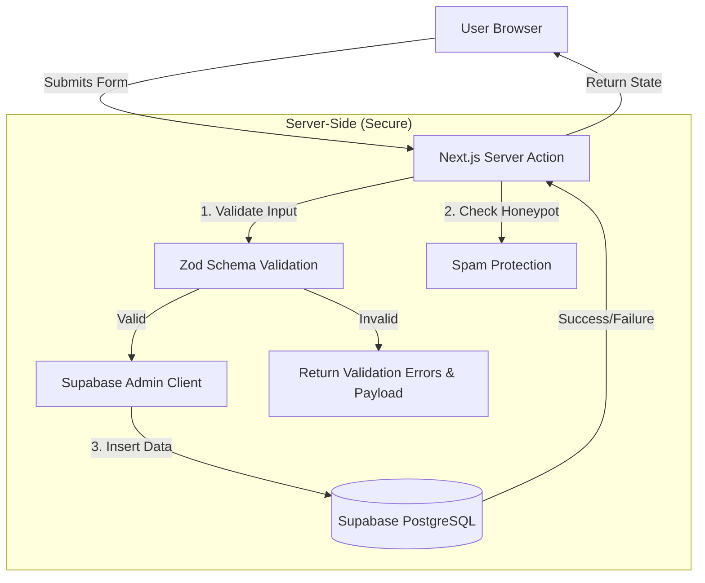
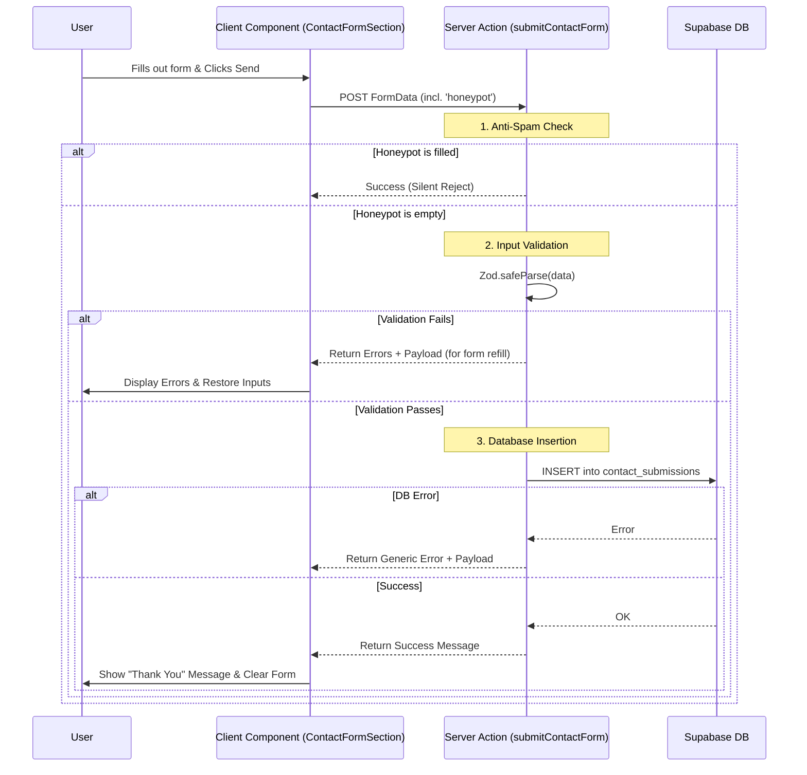

# Contact Form System Implementation Guide

This document details the architecture, design, and implementation steps for the Watto Contact Form system.

## 1. System Overview

The contact form system has been streamlined to a single, unified "Get in Touch" form that handles all types of inquiries. This improves user experience and simplifies maintenance.

The system is built using **Next.js Server Actions** for backend logic, **Zod** for validation, and **Supabase (PostgreSQL)** for persistence.

## 2. Architecture & Data Flow

### 2.1 High-Level Architecture



### 2.2 Detailed Submission Flow



## 3. Database Design

We use a single table strategy.

### Schema: `contact_submissions`

| Column | Type | Nullable | Description |
| :--- | :--- | :--- | :--- |
| `id` | UUID | No | Primary Key (auto-generated) |
| `created_at` | TIMESTAMPTZ | No | Submission timestamp (default: now()) |
| `name` | TEXT | No | Submitter's name |
| `email` | TEXT | No | Submitter's email |
| `phone` | TEXT | Yes | Submitter's phone number |
| `topic` | TEXT | Yes | Selected topic (e.g., "General Inquiry") |
| `message` | TEXT | Yes | The inquiry message |
| `metadata` | JSONB | Yes | Future-proofing for extra fields |

### Security (RLS)
- **Row Level Security** is ENABLED.
- **Service Role** (Admin) has full access.
- **Anon/Public** has NO direct access (inserts are handled via trusted Server Actions).

## 4. Implementation Details

### 4.1 Server Action (`app/actions/contact.ts`)
Handles the request cycle. It returns an `ActionState` object containing:
- `success`: boolean
- `message`: string
- `errors`: Field-specific error messages (if any)
- `payload`: The original form data (to repopulate the form on error)

### 4.2 Zod Schemas (`lib/schemas/contact.ts`)
Defines strict rules for the form.
- **Single Schema**: `ContactFormSchema` validates all fields.
- **Production-Grade**: Includes trimming, regex patterns, and length limits.

### 4.3 Supabase Admin Client (`lib/supabase/server.ts`)
Instantiates a Supabase client using the `SUPABASE_SERVICE_ROLE_KEY` to bypass RLS policies for insertion.

## 5. Validation Logic

The application uses **Zod** to strictly validate all incoming data.

### Fields Rules
| Field | Rule | Error Message |
| :--- | :--- | :--- |
| **Name** | Required, 2-100 chars, valid chars only | "Name must be at least 2 characters", "Name contains invalid characters" |
| **Email** | Required, max 255 chars, valid format | "Invalid email address" |
| **Phone** | Optional, max 20 chars, valid phone chars | "Phone number contains invalid characters" |
| **Topic** | Required, must be one of predefined list | "Please select a valid topic" |
| **Message** | Required, 10-2000 chars | "Message must be at least 10 characters" |
| **Honeypot** | Optional, **Must be empty** | (Silent failure / fake success if filled) |

## 6. Error Handling Strategy

### Scenario 1: Validation Failure
- **Trigger**: User leaves a required field empty or provides invalid input.
- **Action**: Server returns `{ success: false, errors: {...}, payload: {...} }`.
- **UI Result**: Form fields are repopulated with the user's input, and specific error messages are shown below each invalid field.

### Scenario 2: Spam Detection (Honeypot)
- **Trigger**: A bot fills in the hidden `honeypot` field.
- **Action**: Server logs a warning but returns a **fake success** response.
- **Reasoning**: This prevents bots from optimizing their attacks.

### Scenario 3: Database/System Error
- **Trigger**: Database down or internal error.
- **Action**: Server catches error, logs it, and returns generic failure message + payload.
- **UI Result**: Generic error alert shown, form data preserved.

## 7. Setup & Deployment Steps

### Step 1: Environment Variables
Create or update `.env.local` in `watto-client/`:

```bash
SUPABASE_URL=your_project_url
SUPABASE_SERVICE_ROLE_KEY=your_service_role_key
```

### Step 2: Database Migration
Run the SQL migration script located at:
`watto-client/supabase/migrations/20260213_contact_schema.sql`

### Step 3: Deployment
1.  Push code to GitHub.
2.  Connect repository to Vercel.
3.  Add the Environment Variables in Vercel Project Settings.
4.  Deploy.

## 8. Directory Structure

```
watto-client/
├── app/
│   └── actions/
│       └── contact.ts       # Server Action logic
├── components/
│   └── contact/
│       └── ContactFormSection.tsx  # Client-side form UI
├── lib/
│   ├── schemas/
│   │   └── contact.ts       # Zod validation schemas
│   └── supabase/
│       └── server.ts        # Admin client initialization
└── supabase/
    └── migrations/
        └── 20260213_contact_schema.sql # SQL for DB setup
```
